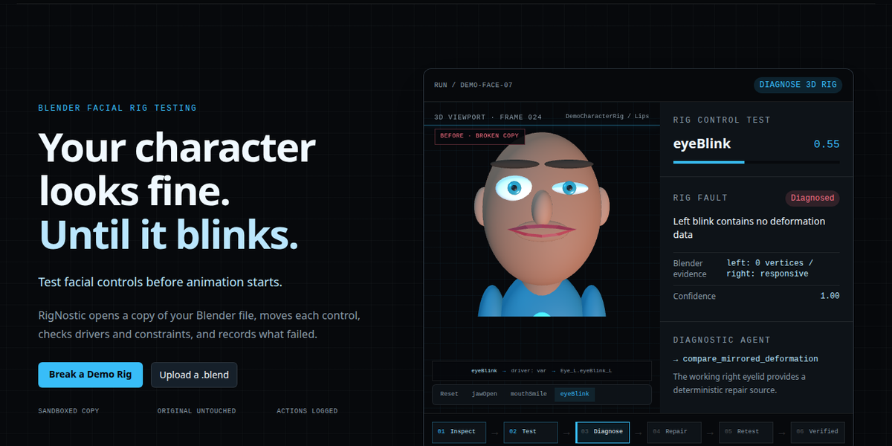
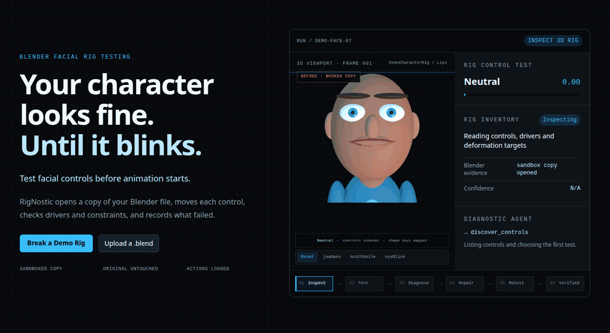
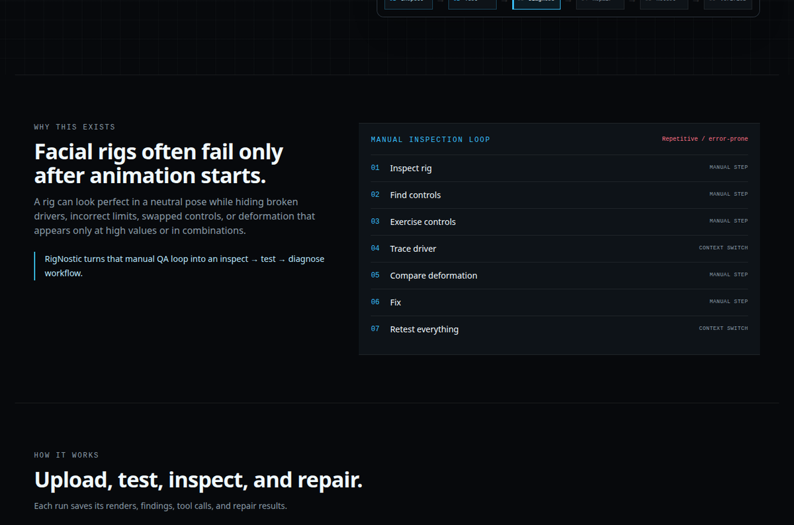

<div align="center">

# RigNostic

**Find broken Blender facial controls before animation starts.**

RigNostic opens a sandboxed copy of a `.blend` file, exercises facial controls,
records Blender evidence, proposes supported repairs, and repeats the failed test.

The diagnostic agent selects each Blender inspection from a fixed allowlist based
on the evidence collected so far. Every selection, tool result, and final report
is stored with the run.

[Quick start](#quick-start) · [Agent traces](AGENT_TRACES.md) · [How it works](#how-it-works) · [Demo rigs](#demo-rigs) · [Documentation](#documentation)

</div>



## What it does

Facial rigs can look correct in a neutral pose while hiding broken drivers,
empty shape keys, reversed controls, bad limits, or asymmetric deformation.
RigNostic runs those checks before an animator has to find the problem manually.

| Stage | What RigNostic records |
| --- | --- |
| Inspect | Controls, shape keys, drivers, constraints, and object ownership |
| Test | Control values and the resulting deformation |
| Diagnose | Failed control, likely cause, supporting Blender data, and confidence |
| Repair | The exact change written to a new sandboxed copy |
| Retest | The original failing test replayed against the repaired rig |
| Compare | Synchronized before/after 3D viewers and a property diff |

The uploaded file is never overwritten. A repaired file is published only after
the verification step passes.

## Repair loop

The animation below is captured from the real Three.js landing-page component.
It follows a broken left blink from inspection through repair and verification.

<div align="center">
  
</div>

## Quick start

### Docker Compose

```bash
cp .env.example .env
# Add GEMINI_API_KEY to .env
docker compose up --build
```

Open [http://127.0.0.1:5000](http://127.0.0.1:5000).

PostgreSQL, Blender 4.5.13 LTS, Python dependencies, frontend dependencies, and
the Flask development server are included in the Compose setup. Source files are
bind-mounted, so Python, Jinja, CSS, and JavaScript edits reload without rebuilding
the image. Rebuild only after changing dependencies or the Dockerfile.

### Run without Docker

```bash
uv sync --dev
npm install
npm run build
export BLENDER_EXECUTABLE=/absolute/path/to/blender
docker compose up -d postgres
uv run python -m rignostic.web
```

## How it works



1. The web app stores the uploaded rig under an isolated run directory.
2. Blender opens the copy in a headless subprocess.
3. Inspection tools enumerate controls, drivers, constraints, and shape keys.
4. The analysis process chooses controls to test and records their response.
5. Findings are stored with their affected controls and supporting data.
6. Supported repairs are applied to another copy and the failed checks are rerun.
7. The user compares both versions and downloads the verified result.

## Current checks

| Area | Examples | State |
| --- | --- | --- |
| Drivers | Muted driver, multiplier, reversed direction, wrong target | Supported |
| Shape keys | Zero affected vertices, asymmetric movement, excessive range | Supported |
| Constraints | Muted constraint, influence, malformed limits | Supported |
| Control mapping | Swapped sides and unexpected targets | Review may be required |
| Combined controls | Pairwise and higher-order interactions | Planned |

Automatic repair is intentionally narrower than detection. The current repair
path handles high-confidence changes that can be checked deterministically, such
as restoring deformation from a matching counterpart and correcting known driver,
shape-key, or constraint properties.

## Model providers

Model calls go through the LiteLLM Python SDK. Gemini is the default, while the
rest of the analysis pipeline remains provider-independent.

```dotenv
# Default Gemini configuration
GEMINI_API_KEY=...
RIGNOSTIC_MODEL=gemini-3.5-flash-lite

# Other LiteLLM model names also work
RIGNOSTIC_MODEL=openai/gpt-5-mini
RIGNOSTIC_MODEL=anthropic/claude-sonnet-4-5
RIGNOSTIC_MODEL=openrouter/...
RIGNOSTIC_MODEL=ollama/...
```

Add the API key required by the selected provider and restart the application.

## Demo rigs

Ready-to-upload fixtures are included in [`demo_asset`](demo_asset):

| Rig | Clean | Broken |
| --- | --- | --- |
| Face | `rignostic_demo_face_v2.blend` | `rignostic_demo_face_v2_broken.blend` |
| Full body | `rignostic_demo_full_body_v1.blend` | `rignostic_demo_full_body_v1_broken.blend` |

The broken fixtures contain controlled defects including a frozen left blink,
a reversed right smile, and excessive jaw movement. The analysis process does
not receive the fixture ground truth in its prompt.

Regenerate the full-body fixture with:

```bash
.tools/blender/blender --background --python demo_asset/create_demo_full_body.py -- \
  --output demo_asset/rignostic_demo_full_body_v1.blend
```

## Command-line repair

Preview a repair plan without changing the file:

```bash
uv run rignostic repair broken.blend --reference trusted_clean.blend
```

Apply the reviewed plan to a new file:

```bash
uv run rignostic repair broken.blend --reference trusted_clean.blend \
  --apply --output repaired.blend
```

The web analysis flow can also infer supported repairs without requiring a clean
reference. The reference-guided CLI remains available for deterministic fixture
comparison and controlled repair work.

## Development checks

```bash
uv run rignostic doctor
uv run rignostic blender-version
uv run ruff check .
uv run pytest
```

Current automated test result: **46 passed, 1 skipped**. The skipped test is the
opt-in live model call, which can incur provider usage.

## Evaluation status

The checked-in synthetic benchmark contains ten controlled broken rigs. The
recorded Stage 0 result detected 2 of 11 defects with 4 false positives. Those
results are retained under [`results/baseline`](results/baseline) and
[`trajectories/baseline`](trajectories/baseline); they are not replaced with
marketing estimates.

| Workflow | Recall | False positives | Runtime | Model calls |
| --- | ---: | ---: | ---: | ---: |
| Stage 0 baseline | 18.2% (2/11) | 4 | 35.66s | 10 |
| Iteration 1 discovery | 18.2% (2/11) | 10 | 60.59s | 10 |
| Final adaptive + deterministic validation | **100% (11/11)** | **0** | 119.40s | 80 |

The final run used the unchanged cases and evaluator. The agent never received
gold labels; deterministic validation used only Blender driver, constraint,
shape-key range, target, and deformation evidence. Per-case results and traces
are committed under [`results/final_benchmark`](results/final_benchmark).

Run the recorded workflows with:

```bash
uv run rignostic baseline-all       # frozen Stage 0
uv run rignostic iteration-01-all   # structured discovery
uv run rignostic final-all          # shipped adaptive workflow
```

Each `*-run` command finishes before its matching evaluator opens the committed
gold labels. See the [reproduction guide](docs/REPRODUCTION.md) for benchmark
generation and separate run/evaluate commands.

## Stack

- Flask, Jinja2, and Tailwind CSS
- Three.js rig and comparison viewers
- Blender 4.5.13 LTS headless subprocesses
- PostgreSQL with Flask-SQLAlchemy
- LiteLLM model adapter, with Gemini as the default
- Docker Compose development environment

## Documentation

- [Architecture](docs/ARCHITECTURE.md)
- [Reproduction instructions](docs/REPRODUCTION.md)
- [Evaluation contract](docs/EVALUATION.md)
- [Improvement changelog](docs/IMPROVEMENT_CHANGELOG.md)
- [Hackathon demo script](docs/DEMO_SCRIPT.md)
- [Judge-facing submission package](submission/README.md)

## Submission context

RigNostic is for technical artists, riggers, and animation teams who need to
validate facial controls before animation begins. A neutral pose can conceal a
muted driver, empty shape key, reversed deformation, excessive range, or a
failure that appears only when controls interact. Finding these defects during
animation is slow and causes avoidable rework; RigNostic makes the inspection,
evidence, repair proposal, and retest reviewable before handoff.

The repository was empty when the hackathon work began. Everything specific to
RigNostic—application code, agent instructions, benchmark, synthetic fixtures,
evaluation, tests, web experience, and documentation—was added during the
hackathon. Third-party runtimes and libraries are listed in the tech stack and
lockfiles. See [the full disclosure](docs/PRE_EXISTING_WORK.md).

Recorded Stage 0 execution took 35.66 seconds for ten model calls and used 7,549
input plus 1,087 output tokens. Cost was not measured at run time and is not
retroactively estimated. The final benchmark took 119.40 seconds, 80 model calls,
88,100 input tokens, and 5,466 output tokens; provider cost was not measured.
Local deterministic tests take about 12 seconds on the
documented development machine; benchmark generation and Blender timings vary
by CPU. Exact baseline, final web, benchmark, evaluation, and test commands are
in the [clean-machine reproduction guide](docs/REPRODUCTION.md).

---

Built for the Agentic Workflows Hackathon.
